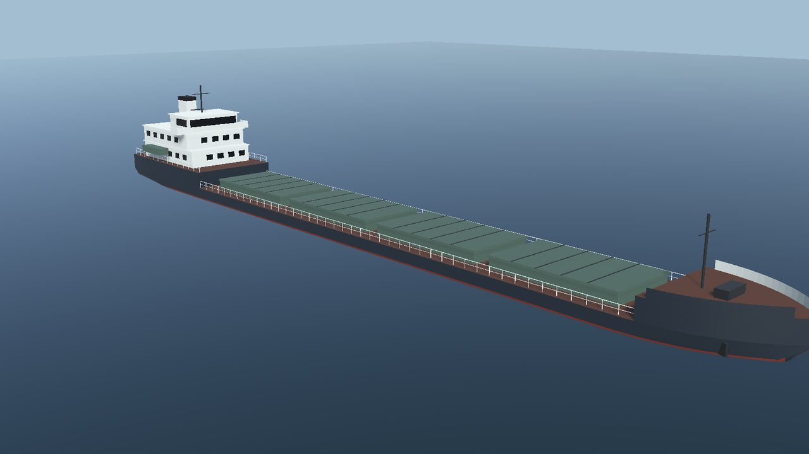
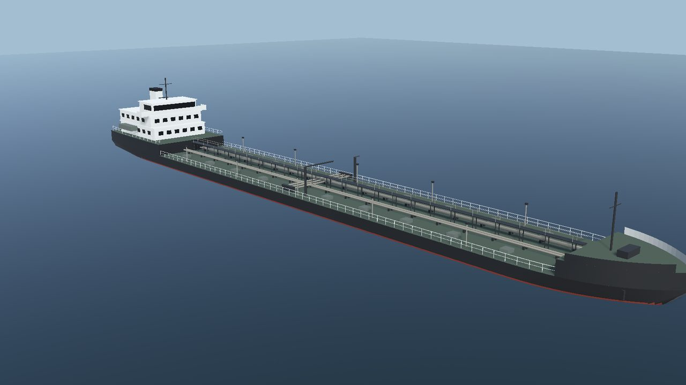
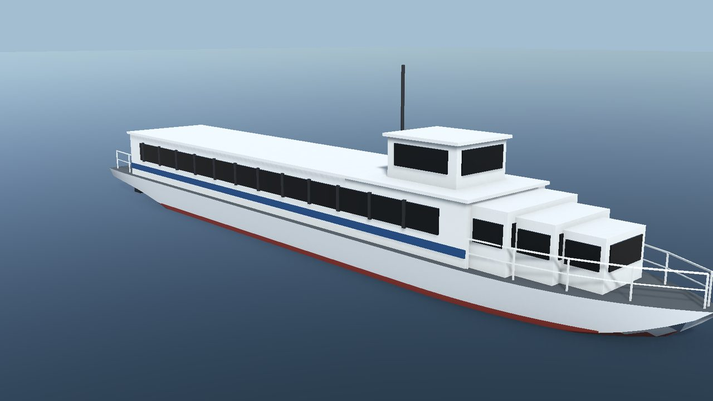
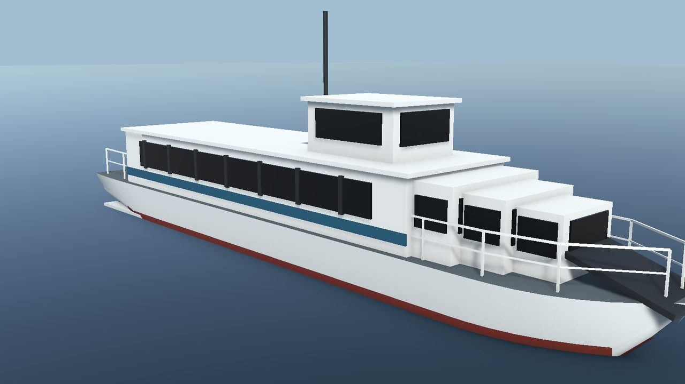

# ShipSim159 Project Status

Updated 2026-09-13. ShipSim159 is an engineering and gameplay prototype of a river navigation
simulator built for several ship models, chosen in the start menu before a passage. Five vessels are
playable: the cargo ships Volgo-Don 507B, Volgo-Balt 2-95A/R and Volgoneft 1577, and the fast
passenger craft Meteor 342U (hydrofoil) and Luch 14352 (skeg air cushion).

The simulator is **not** validated for maritime training or real navigation: most hydrodynamic
coefficients, depths, currents and navigation-light timings are estimates.

This page summarises what exists, what has been verified, what the project looks like and what is
left to do. Detailed references: `ShipSimulator_Physics.md` (model), the sources file for each vessel
(parameter confidence), `OperatorGuide.md` (controls) and `.codex/PROJECT_CONTEXT.md` (work log).

## At a glance

| Item | State |
|---|---|
| Engine | Unity 6000.6.0f1, URP 17.6.0, Input System 1.20.0 |
| Platform | Windows desktop, keyboard and mouse |
| Vessels | 5 playable: cargo ships Volgo-Don 507B, Volgo-Balt 2-95A/R, Volgoneft 1577 and fast passenger craft Meteor 342U (hydrofoil), Luch 14352 (air cushion), chosen in the start menu; KVLCC2 benchmark data for model checks |
| Passages | `GorodetsTrainingScene` (2.27 km mission, default), `RiverTrainingScene` (familiarisation) and `SerpukhovZatonScene` (2.42 km, fast craft only) |
| Automated tests | EditMode 189 passed, PlayMode 34 passed (2026-09-19) |
| Batch runtime checks | Menu smoke (including vessel selection), ship wake, graphics phase one, water weather, buoy graphics, vessel catalogue build, virtual sea trials |

## How it looks

*Gorodets reach at full ahead with the Volgo-Don 507B: Kelvin wake, propeller wash, paired lateral
buoys and fog on the far reach. Captured by `ShipWakeRuntimeCheck`.*

| | |
|---|---|
|  |  |
| Volgo-Balt 2-95A/R, generated from its dimensions: forecastle, four hatch covers, aft house | Volgoneft 1577, generated: walkway, cargo pipelines, manifold and hose cranes |
|  |  |
| Meteor 342U hydrofoil: V-section hull, passenger cabin, wheelhouse, bow and stern foils | Luch 14352 air cushion craft: skegs, cushion tunnel, cabin and bow boarding ramp |
|  |  |
| Cargo deck along a vegetated bank, planar reflections and cloud sky | Overhead: propeller wash and wake following the track |
|  |  |
| Buoy with float, braced tower and flashing lantern | Rain with surface impacts, fog and wind ripples |
|  |  |
| Night: moon glitter, stars, sector running lights | Start menu: new voyage, continue, settings |

## What is implemented

### Simulation core (any vessel)

The ship dynamics follow `ShipDynamicsRealismApproach.md`, phases 1 to 6. Nothing in the model is
specific to one ship: every vessel is a JSON specification checked by `VesselDataValidator`.

- Three-degree-of-freedom MMG manoeuvring model with the full added-mass matrix, applied to the
  Rigidbody as accelerations; Clarke hull derivatives, low-speed cross-flow drag, current shear.
- ITTC-1957 resistance with form factor and a residual coefficient calibrated per vessel to its
  published speed, together with the rated propeller speed.
- Any number of engines and propellers, each with governor, torque and power limits, shaft inertia
  and astern reversal; ahead and astern propeller curves.
- Any number of MMG rudders in the propeller slipstream with stall; optional tunnel bow thruster.
- Blendermann wind loads with gusts; ambient current, trigger current zones and blended regions.
- Restricted water: depth-dependent hydrodynamics, Lackenby speed loss, ICORELS squat with blockage,
  estimated bank suction.
- Station buoyancy with draft, trim and heel; heel from turning and wind; loading from lightship to
  fully loaded.
- Grounding: keel contact springs by bottom type, bottom friction, damage points.
- Virtual sea trials for every vessel: speed steps, turning circles, zig-zags, crash stop.

### Vessels

| Vessel | Model | Published particulars | Notes |
|---|---|---|---|
| Volgo-Don 507B | Imported CRYENGINE mesh, re-axised | 138.3 m, 6750 t, 2 x 662 kW, 10 kn | Bow thruster (reported by the owner, size estimated) |
| Volgo-Balt 2-95A/R | Generated by `ProceduralVesselBuilder` | 113.87 m, 4761 t, 2 x 515 kW, 10 kn | Largest Volgo-Balt series, 79 built 1973 to 1984 |
| Volgoneft 1577 | Generated by `ProceduralVesselBuilder` | 132.6 m, 6477 t, 2 x 736 kW, 20 km/h | With its twin 550A, the largest Volgoneft group, about 135 built |
| Meteor 342U | Generated by `ProceduralVesselBuilder` | 34.6 m, 53.4 t, 114 passengers, 2 x 736 kW, 65 km/h | Hydrofoil; over 400 of the family built. Foils carry the hull above about 30 km/h |
| Luch 14352 | Generated by `ProceduralVesselBuilder` | 23.7 m, 57 passengers, 1 x 382 kW, 40 km/h | Skeg air cushion; over 80 of the type built. Draft falls from 0.66 m to 0.45 m on cushion |

- `Resources/VesselCatalogue.asset` lists the vessels. The start menu offers a vessel step before the
  passage and shows each vessel's particulars from its data.
- `VesselSwap` replaces the scene's built-in 507B with the chosen prefab before any `Start` runs, then
  moves the camera, HUD, grounding and mission to it. Saves record the vessel.
- `VesselLayout` on each prefab holds the navigation light positions, the navigator eye point and the
  camera scale, so lights, bridge view and orbit cameras fit each ship. The HUD rudder scale uses each
  vessel's maximum rudder angle.
- Generated models are built from each ship's dimensions, propeller and rudder data: spoon bow, stern
  cut up over the propellers, forecastle and poop, aft house with wheelhouse, bridge wings, funnel and
  masts, railings, and either hatch covers or tanker pipework. `Ship Simulator > Build Vessel
  Catalogue` regenerates them and renders previews into `Logs/Vessels/`.

### Passages

- **Gorodets reach** (`Ship Simulator > Build Gorodets Scenario`): 2.27 km curved route, asymmetric
  procedural bathymetry, rocky shoals, paired lateral marks, three lit leading-mark pairs, six current
  regions, grounding and damage, warnings and scoring. Mission phases: briefing, depart approach,
  acquire the Gorodets leading line, pass Gorodets shoal, pass Upper Kochergino, pass Lower
  Kochergino, reach finish.
- **River familiarisation**: straight reach with buoys, banks and current zones.
- **Serpukhov zaton** (`Ship Simulator > Build Serpukhov Zaton Scenario`): 2.42 km from the Oka, in
  through the mouth of the Nara and up into the Serpukhov lay-up basin. Shoreline traced from
  OpenStreetMap water outlines; published channel dimensions (20 m on the Nara, 30 m on the Oka,
  100 m bend radius) with estimated navigation-season depths. Unlit marks only, because the reach is
  a third-category waterway. Restricted in the start menu to vessels within 40 m x 10 m x 1.6 m,
  which admits the Meteor and the Luch. Sources and estimates in
  `SerpukhovZatonScenario_Sources.md`; stills from `Ship Simulator > Render Serpukhov Zaton Preview`.

### Bridge, HUD and menus

- Maritime start menu with vessel and passage choice, pause menu, persistent settings and a single
  saved voyage with atomic replacement and a `.bak` copy.
- HUD: speed, course, drift, depth, under-keel clearance, current, cargo, rudder angle and command,
  per-engine telegraph with shaft RPM and load, bow thruster state (hidden for vessels without one),
  warnings, objective and score.
- Heading-up river radar with depth zones, fairway route, track, predicted path from the actual rate
  of turn, buoys and waypoint; minimap.
- Nine cameras including bridge, docking and navigator views; simulation time 1x, 2x, 4x.
- Weather panel: wind force and direction, rain, fog; day and night.

### Graphics and environment

- Reflective river water shader: planar reflections, wind ripples and gust patches, Kelvin wake, bow
  wave, propeller wash, foam, bank-wave flattening, rain rings and splashes, fog. Wake size follows the
  vessel's dimensions.
- Cloud sky with cloud shadows, sky-driven ambient light, auto exposure, TAA with motion vectors.
- Natural banks, trees, bushes and reeds with LODs and wind sway.
- Night: moon, stars, sector-correct ship running lights, flashing buoy lanterns, lit leading marks.

### Tooling

- `Ship Simulator` editor menu: scene builders, model integration, vessel catalogue build, visual
  upgrades, previews, virtual sea trials, play and stop.
- Batch checks that exit with PASS or FAIL and write captures to `Logs/`: `VoyageMenuSmokeCheck`,
  `ShipWakeRuntimeCheck`, `GraphicsPhaseOneCheck`, `WaterWeatherCheck`, `BuoyGraphicsCheck`,
  `VesselCatalogueBuilder.Run`, `VirtualSeaTrials`.

## What works (verified)

| Check | Latest result |
|---|---|
| Batch compile | Clean, exit 0 |
| EditMode tests | 169 passed, 0 failed |
| PlayMode tests | 23 passed, 0 failed |
| `VesselCatalogueBuilder.Run` | `VESSEL_CATALOGUE|PASS`: prefabs, catalogue and previews rebuilt |
| `VoyageMenuSmokeCheck` | `MENU_SMOKE|PASS`: river voyage in the 507B, Gorodets in the Volgoneft, load restores the 507B |
| `VirtualSeaTrials` | `SEA_TRIALS|PASS`: deep-water loaded results inside the IMO MSC.137(76) envelope for the three cargo ships; fast craft reported without that envelope |
| `ShipWakeRuntimeCheck`, graphics checks | PASS in their last runs |

Simulated sea trials, all from estimated coefficients (distances in ship lengths L between
perpendiculars):

| Vessel and condition | Slow / half / full | Advance | Tactical diameter | 10/10 overshoots | Crash stop | Bow squat at full |
|---|---|---|---|---|---|---|
| 507B loaded, deep water | 3.0 / 6.3 / 9.8 kn | 3.22 L | 3.70 L | 3.6 / 4.2 deg | 4.48 L, 263 s | 0 m |
| 507B loaded, Gorodets 4.6 m | 2.3 / 4.7 / 6.9 kn | 4.34 L | 6.59 L | 1.0 / 1.0 deg | 2.25 L, 186 s | 0.29 m |
| Volgo-Balt loaded, deep water | 3.1 / 6.4 / 9.9 kn | 3.13 L | 3.52 L | 4.1 / 4.9 deg | 4.54 L, 213 s | 0 m |
| Volgo-Balt loaded, Gorodets 4.6 m | 2.5 / 5.1 / 7.4 kn | 5.62 L | 8.75 L | 0.8 / 0.8 deg | 2.60 L, 161 s | 0.37 m |
| Volgoneft loaded, deep water | 3.3 / 6.9 / 10.7 kn | 3.31 L | 3.76 L | 3.9 / 4.5 deg | 4.99 L, 254 s | 0 m |
| Volgoneft loaded, Gorodets 4.6 m | 2.5 / 5.2 / 7.5 kn | 4.45 L | 6.72 L | 1.1 / 1.1 deg | 2.52 L, 181 s | 0.38 m |
| Meteor 342U, deep water | 8.9 / 17.6 / 34.4 kn | 3.08 L | 2.93 L | 14.3 / 14.2 deg | 6.14 L, 20 s | 0 m |
| Meteor 342U, Gorodets 4.6 m | 8.8 / 16.4 / 34.3 kn | 3.11 L | 2.97 L | 13.8 / 13.7 deg | 6.16 L, 20 s | 0 m |
| Luch 14352, deep water | 5.4 / 13.8 / 21.1 kn | 3.13 L | 2.62 L | 10.7 / 10.4 deg | 5.76 L, 21 s | 0 m |
| Luch 14352, Gorodets 4.6 m | 5.4 / 13.2 / 21.1 kn | 3.14 L | 2.61 L | 10.5 / 10.4 deg | 5.53 L, 21 s | 0 m |
| KVLCC2 benchmark, deep water | 4.6 / 9.9 / 15.4 kn | 3.00 L | 3.09 L | 5.7 / 10.3 deg | 5.58 L, 488 s | 0 m |

The Volgo-Balt's wide turn in the Gorodets reach follows from its 3.86 m draft: 4.6 m of water is only
1.19 times its draft, where depth effects on the hull are strongest. The two fast craft barely notice
that depth, because once supported they draw 1.2 m (foils) and 0.45 m (skegs). The IMO envelope is
written for displacement ships, so their rows are reported without it.

## Known issues and limitations

- **Not validated.** No trial data, lines plans, propeller, rudder or thruster drawings were available
  for any vessel; those parameters are estimates listed in each sources file.
- **Generated models are simple.** The Volgo-Balt, Volgoneft, Meteor and Luch meshes are untextured
  and use estimated superstructure proportions and liveries; they are not built from drawings or
  photos. The Meteor's streamlined silhouette in particular is only approximated.
- **Fast craft support is a simple model.** One speed-dependent lift fraction stands in for cushion
  and foil systems: takeoff speeds, supported drag factors and the hump are estimates, and foil lift
  distribution, banked turns, cushion pitch stability and lift-fan dynamics are not modelled. Hull
  contact for grounding still uses the hull keel, while the reported clearance uses the foils or
  skegs.
- **Environment is not real geography.** Bathymetry, route geometry and currents of the Gorodets
  reach are procedural estimates, not surveyed data or charts. The Serpukhov zaton scene traces its
  shoreline from OpenStreetMap and uses the published channel width, bend radius and mark category,
  but its depths, currents, shoals and mark positions are estimates: no public survey or buoy scheme
  of that reach exists.
- **The Serpukhov scene is outside the graphics passes.** `Upgrade Water And Landscape`,
  `Apply Realistic Water And Sky` and `Apply Graphics Phase One` still cover only the two original
  scenes, and its shore structures are placeholder boxes.
- **Model simplifications.** Quadratic propeller curves rather than four-quadrant data; estimated bank
  suction; wall-sided station hydrostatics; no wave loads; Unity collider contacts bypass the
  added-mass solve.
- **Missing features.** No other traffic or ship-ship interaction, locks, mooring lines, anchors,
  tugs, autopilot, AIS or ECDIS. Gorodets scenario phase 3 (discharge presets, hold point, meeting
  traffic, fog variant, debrief) is not built.
- **Input and UI.** Keyboard is polled directly: no rebinding, no gamepad. The HUD uses legacy
  `UnityEngine.UI.Text` and its telegraph controls support at most two engines.
- **Runtime log noise.** `RiverLighting.CaptureSky` throws a `MissingReferenceException` during scene
  switches (seen in the menu smoke log); the checks still pass.
- **Graphics.** Roadmap phase 1 and phase 2 Steps 0 and 1 are implemented: baseline captures,
  timing logs, water refraction, depth absorption, filtered reflections and specular antialiasing.
  RTX 3060 / 1080p GPU acceptance remains open; timings collected on RTX 4090 do not establish
  that budget. The rain-toward-sun temporal crop increased variance by 10.2%, although eight of
  ten crops improved. Height fog and current-driven flow remain in `GraphicsPhaseTwoPlan.md`.

## What needs to be done

In priority order:

1. **Obtain vessel documentation and calibrate.** For each vessel: manoeuvring booklet or trial
   reports, lines plan, propeller, rudder and thruster data; recalibrate with `VirtualSeaTrials` and
   agree tolerances with maritime specialists.
2. **Real river data for the Gorodets reach.** Surveyed bathymetry, water levels and current
   measurements; real DEM and bank geometry.
3. **Finish the Gorodets scenario.** Discharge presets and briefing choice, hold point, meeting
   traffic with clearance rules, fog cancellation variant, debrief timeline.
4. **Traffic and interaction.** AI vessels that reuse catalogue ships, ship-ship interaction forces,
   locks, mooring lines, anchors (dynamics roadmap phase 7).
5. **Better vessel models.** Textures, weathering, names and draft marks, superstructure details from
   photographs or drawings, or imported meshes to replace the generated ones; a preview in the vessel
   menu; loading conditions selectable per voyage.
6. **Model fidelity.** Four-quadrant propeller data, a published bank-effect formulation, hull-lines
   hydrostatics, collisions through the added-mass solve.
7. **Controls and UI.** Input Actions with rebinding and gamepad support; telegraphs for any engine
   count; move the HUD to TextMesh Pro or UI Toolkit.
8. **Graphics phase 2.** Validate the implemented water optics on RTX 3060 at 1080p and review
   rainy-water temporal variance. Then height fog with sun in-scattering and current-driven flow
   maps. Steps, acceptance criteria and checks are in `GraphicsPhaseTwoPlan.md`.
9. **Engineering hygiene.** Fix the `RiverLighting.CaptureSky` exception; add loader parse-error and
   missing-component tests; record a frame-time budget.
