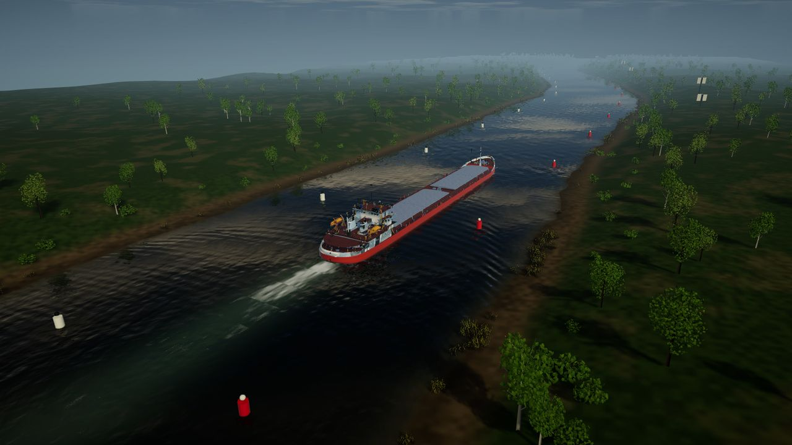
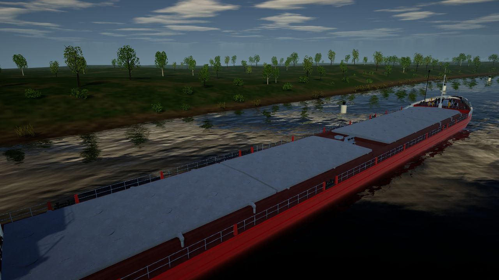
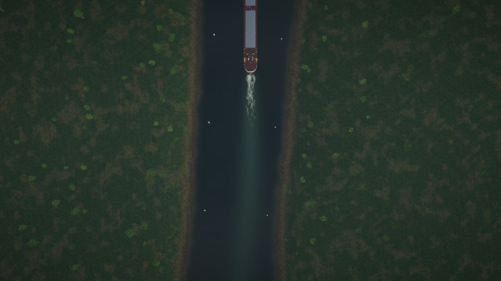
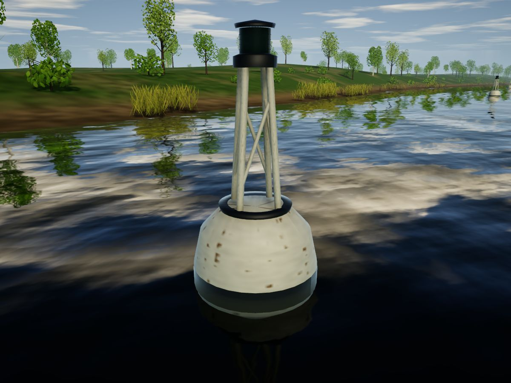
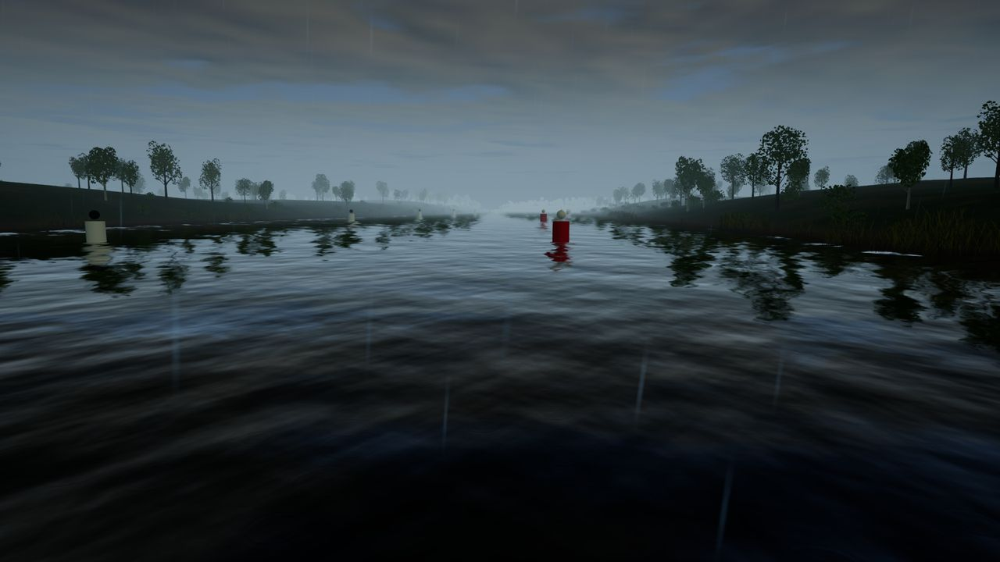
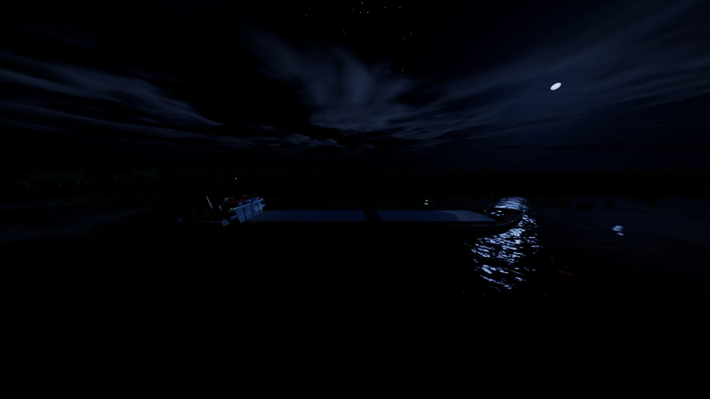
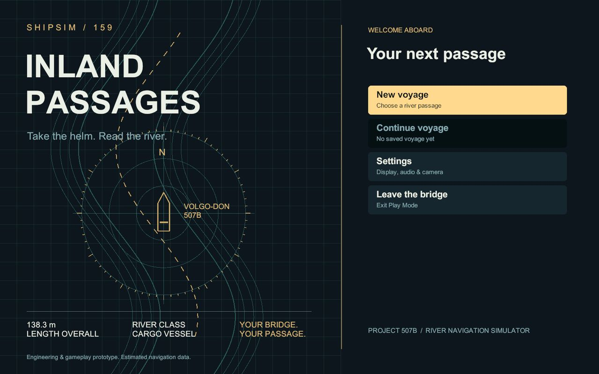

# ShipSim159 Project Status

Updated 2026-09-13. ShipSim159 is an engineering and gameplay prototype of a river navigation
simulator. It is built to carry several ship models, which the player will choose in the start menu
before a passage. Today one vessel is playable: a Project 507B Volgo-Don dry cargo ship, the first
entry of that future catalogue.

The simulator is **not** validated for maritime training or real navigation: most hydrodynamic
coefficients, depths, currents and navigation-light timings are estimates.

This page summarises what exists, what has been verified, what the project looks like and what is
left to do. Detailed references: `ShipSimulator_Physics.md` (model), `VolgoDon507B_Sources.md`
(parameter confidence for the first vessel), `OperatorGuide.md` (controls) and
`.codex/PROJECT_CONTEXT.md` (work log).

## At a glance

| Item | State |
|---|---|
| Engine | Unity 6000.6.0f1, URP 17.6.0, Input System 1.20.0 |
| Platform | Windows desktop, keyboard and mouse |
| Vessels | 1 playable (Project 507B Volgo-Don, 138.3 m, twin screw, bow thruster); KVLCC2 benchmark data runs in simulation tests only; vessel selection not built yet |
| Passages | `GorodetsTrainingScene` (2.27 km mission, default) and `RiverTrainingScene` (familiarisation) |
| Code | About 12 100 lines of runtime and editor C#, 2 700 lines of tests |
| Automated tests | EditMode 118 passed, PlayMode 17 passed (latest recorded runs) |
| Batch runtime checks | Menu smoke, ship wake, graphics phase one, water weather, buoy graphics, virtual sea trials |

## How it looks

*Gorodets reach at full ahead with the first vessel, the 507B: Kelvin wake, propeller wash, paired
lateral buoys and fog on the far reach. Captured by `ShipWakeRuntimeCheck`.*

| | |
|---|---|
|  |  |
| Cargo deck along a vegetated bank, planar reflections and cloud sky | Overhead: propeller wash and wake following the track |
|  |  |
| Buoy with float, braced tower and flashing lantern | Rain with surface impacts, fog and wind ripples |
|  |  |
| Night: moon glitter, stars, sector running lights | Start menu: new voyage, continue, settings |

## What is implemented

### Simulation core (any vessel)

The ship dynamics follow `ShipDynamicsRealismApproach.md`, phases 1 to 6. Nothing in the model is
specific to one ship: every vessel is described by a JSON specification checked by
`VesselDataValidator`, and the same code runs the 507B and the KVLCC2 benchmark.

- Three-degree-of-freedom MMG manoeuvring model with the full added-mass matrix, applied to the
  Rigidbody as accelerations; Clarke hull derivatives, low-speed cross-flow drag, current shear.
- ITTC-1957 resistance with form factor and a residual coefficient calibrated per vessel.
- Any number of engines and propellers, each with governor, torque and power limits, shaft inertia
  and astern reversal (fuel cut, brake, restart delay); ahead and astern propeller curves.
- Any number of MMG rudders in the propeller slipstream with stall.
- Optional tunnel bow thruster: actuator disc thrust, loss of effect with speed, no thrust when the
  tunnel is out of the water.
- Blendermann wind loads with gusts; ambient current, trigger current zones and blended current
  regions.
- Restricted water: depth-dependent hydrodynamics, Lackenby speed loss, ICORELS squat with blockage,
  estimated bank suction.
- Station buoyancy with draft, trim and heel; heel from turning and wind; roll and heave damping.
- Loading from lightship to fully loaded changes mass, draft, windage, added mass and hull
  derivatives.
- Grounding: keel contact springs by bottom type (silt, sand, rock), bottom friction, damage points.
- Virtual sea trials for any vessel JSON: speed steps, turning circles, 10/10 and 20/20 zig-zags,
  crash stop, bow thruster turn from rest.

### First vessel: Project 507B Volgo-Don

- Detailed model imported from a CRYENGINE source, re-axised for Unity, with URP materials and a
  compound bow, midship and stern collision hull.
- `VolgoDon507B.json`: published particulars (dimensions, displacement, engine power, speed) plus
  estimated manoeuvring coefficients, each listed in `VolgoDon507B_Sources.md`.
- Running lights, camera views and HUD rudder scale are currently set up for this ship.

### Passages

- **Gorodets reach** (`Ship Simulator > Build Gorodets Scenario`): 2.27 km curved route, asymmetric
  procedural bathymetry, rocky shoals, paired lateral marks, three lit leading-mark pairs, six current
  regions, grounding and damage, warnings and scoring. Mission phases: briefing, depart approach,
  acquire the Gorodets leading line, pass Gorodets shoal, pass Upper Kochergino, pass Lower
  Kochergino, reach finish.
- **River familiarisation**: straight reach with buoys, banks and current zones.

### Bridge, HUD and menus

- Maritime start menu with passage choice, pause menu, persistent settings (volume, camera
  sensitivity, graphics quality, VSync, fullscreen) and a single saved voyage with atomic
  replacement and a `.bak` copy.
- HUD: speed, course, drift, depth, under-keel clearance, current, cargo, rudder angle and command,
  per-engine telegraph with shaft RPM and load, bow thruster state (hidden for vessels without one),
  warnings, objective and score.
- Heading-up river radar with depth zones, fairway route, track, predicted path from the actual rate
  of turn, buoys and waypoint; minimap.
- Nine cameras including bridge, docking and navigator views; simulation time 1x, 2x, 4x.
- Weather panel: wind force and direction, rain, fog; day and night.

### Graphics and environment

- Reflective river water shader: planar reflections, wind ripples and gust patches, Kelvin wake, bow
  wave, propeller wash, foam, bank-wave flattening and weak reflection, rain rings and splashes, fog.
  Wake size follows the vessel's dimensions.
- Cloud sky with cloud shadows, sky-driven ambient light, auto exposure, TAA with motion vectors.
- Natural banks, trees, bushes and reeds with LODs and wind sway driven by the same gust field.
- Night: moon, stars, sector-correct ship running lights, flashing buoy lanterns, lit leading marks.

### Tooling

- `Ship Simulator` editor menu: scene builders, model integration, visual upgrades, previews, virtual
  sea trials, play and stop.
- Batch checks that exit with PASS or FAIL and write captures to `Logs/`: `VoyageMenuSmokeCheck`,
  `ShipWakeRuntimeCheck`, `GraphicsPhaseOneCheck`, `WaterWeatherCheck`, `BuoyGraphicsCheck`,
  `VirtualSeaTrials`.

## Readiness for more vessels

| Ready now | Still tied to the 507B |
|---|---|
| Physics, loading and validation read everything from vessel JSON | Both scenes are built with the `VolgoDon507B` prefab placed in them |
| Engine, propeller and rudder counts and the bow thruster are optional data | Each prefab points at one JSON file; there is no vessel catalogue |
| Sea trials run any vessel file (the KVLCC2 benchmark proves it) | The start menu names the 507B and shows its length |
| Wake size, draft, squat and grounding points come from the vessel data | The HUD rudder scale assumes 35 degrees instead of the vessel's maximum |
| The HUD hides the bow thruster when a vessel has none | Camera views and running-light positions are fixed for a ship of about 138 m |
| Per-engine save data checks its length against the vessel | Saves do not record which vessel was sailing |
| | Telegraph keys and HUD support one or two engines, not more |
| | The model import tool (`VolgoDonModelIntegrator`) is written for this one model |

## What works (verified)

| Check | Latest result |
|---|---|
| Batch compile | Clean, exit 0, no `error [A-Z]` |
| EditMode tests | 118 passed, 0 failed |
| PlayMode tests | 17 passed, 0 failed |
| `VoyageMenuSmokeCheck` | `MENU_SMOKE|PASS`: start, save, change scenario, load, pause, resume |
| `ShipWakeRuntimeCheck` | `WAKE_RUNTIME|PASS`: ship under way and clear of the bottom at both captures |
| `VirtualSeaTrials` | `SEA_TRIALS|PASS`: deep-water loaded results inside the IMO MSC.137(76) envelope |
| `GraphicsPhaseOneCheck`, `WaterWeatherCheck`, `BuoyGraphicsCheck` | PASS in their last runs |

Simulated sea trials, all from estimated coefficients (distances in ship lengths L):

| Vessel and condition | Slow / half / full | Advance | Tactical diameter | 10/10 overshoots | Crash stop | Bow squat at full |
|---|---|---|---|---|---|---|
| 507B loaded, deep water | 3.0 / 6.3 / 9.8 kn | 3.22 L | 3.70 L | 3.6 / 4.2 deg | 4.48 L, 263 s | 0 m |
| 507B loaded, 8.2 m channel | 2.8 / 5.9 / 9.0 kn | 3.09 L | 3.67 L | 3.0 / 3.6 deg | 3.75 L, 240 s | 0.27 m |
| 507B loaded, Gorodets 4.6 m | 2.3 / 4.7 / 6.9 kn | 4.34 L | 6.59 L | 1.0 / 1.0 deg | 2.25 L, 186 s | 0.29 m |
| 507B lightship, deep water | 3.3 / 6.9 / 10.7 kn | 2.20 L | 2.57 L | 2.6 / 2.2 deg | 1.67 L, 81 s | 0 m |
| KVLCC2 benchmark, deep water | 4.6 / 9.9 / 15.4 kn | 3.00 L | 3.09 L | 5.7 / 10.3 deg | 5.58 L, 488 s | 0 m |

507B bow thruster alone from rest: 19.3 deg/min after 180 s in deep water, 9.2 deg/min in the
Gorodets reach, none in lightship condition.

## Known issues and limitations

- **One playable vessel.** The catalogue and the vessel choice in the start menu do not exist yet;
  see "Readiness for more vessels".
- **Not validated.** No trial data, lines plan, propeller, rudder or thruster drawings were available
  for the 507B; those parameters are estimates. Every future vessel needs the same data.
- **Environment is not real geography.** Bathymetry, route geometry and currents of the Gorodets
  reach are procedural estimates, not surveyed data or charts.
- **Model simplifications.** Quadratic propeller curves rather than four-quadrant data; estimated bank
  suction; wall-sided station hydrostatics; no wave loads; Unity collider contacts bypass the
  added-mass solve.
- **Missing features.** No other traffic or ship-ship interaction, locks, mooring lines, anchors,
  tugs, autopilot, AIS or ECDIS. Gorodets scenario phase 3 (discharge presets, hold point, meeting
  traffic, fog variant, debrief) is not built.
- **Input and UI.** Keyboard is polled directly: no rebinding, no gamepad. The HUD uses legacy
  `UnityEngine.UI.Text`.
- **Runtime log noise.** `RiverLighting.CaptureSky` throws a `MissingReferenceException` during scene
  switches (seen in the menu smoke log); the checks still pass.
- **Graphics.** Roadmap phase 1 is done; aerial perspective fog, water refraction and depth
  absorption, flow maps, real terrain and denser ecological vegetation are not.

## What needs to be done

In priority order:

1. **Vessel catalogue and selection in the start menu.**
   - A vessel catalogue asset: id, display name, prefab, JSON specification, short description and a
     preview image per vessel.
   - A vessel step in the start menu before the passage choice, showing particulars read from the
     JSON (length, beam, draft, displacement, power, propulsion arrangement).
   - Spawn the chosen vessel at the passage's start position at runtime instead of baking a ship into
     each scene, and connect HUD, cameras, wake, grounding and the mission controller to it.
   - Record the vessel id in the saved voyage and restore the same vessel.
   - Take vessel-specific presentation from data: rudder scale from the maximum rudder angle, camera
     views from the ship's length and bridge position, running-light positions per vessel, telegraphs
     for any engine count.
   - Generalise the model import tool and write a checklist for adding a vessel: model, collision
     boxes, JSON, source table, sea-trials acceptance.
   - Tests that every catalogue entry validates, spawns and stays inside sea-trial sanity bounds.
2. **Obtain vessel documentation and calibrate.** For each vessel: manoeuvring booklet or trial
   reports, lines plan, propeller, rudder and thruster data; recalibrate with `VirtualSeaTrials` and
   agree tolerances with maritime specialists.
3. **Real river data for the Gorodets reach.** Surveyed bathymetry, water levels and current
   measurements; real DEM and bank geometry.
4. **Finish the Gorodets scenario.** Discharge presets and briefing choice, hold point, meeting
   traffic with clearance rules, fog cancellation variant, debrief timeline.
5. **Traffic and interaction.** AI vessels (which can reuse catalogue vessels), ship-ship interaction
   forces, locks, mooring lines, anchors (dynamics roadmap phase 7).
6. **Model fidelity.** Four-quadrant propeller data, a published bank-effect formulation, hull-lines
   hydrostatics, collisions through the added-mass solve.
7. **Controls and UI.** Input Actions with rebinding and gamepad support; move the HUD to TextMesh Pro
   or UI Toolkit.
8. **Graphics phase 2.** Height fog with sun in-scattering, water refraction and depth absorption,
   current-driven flow maps.
9. **Engineering hygiene.** Fix the `RiverLighting.CaptureSky` exception; add loader parse-error and
   missing-component tests; record a frame-time budget.
