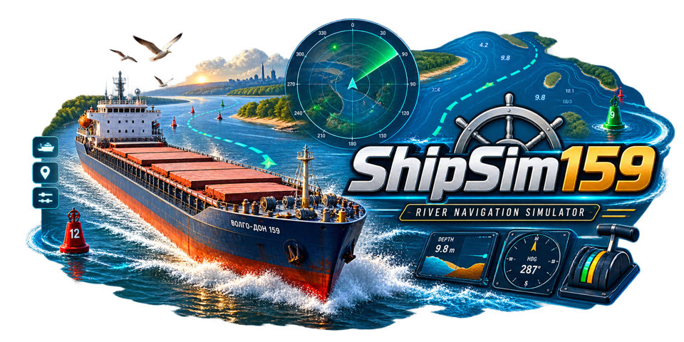

<p align="center">
  
</p>

# ShipSim159

ShipSim159 is a Unity 6 URP prototype of a river navigation simulator. It is
built to carry several ship models, chosen in the start menu before a passage:
three cargo vessels (Volgo-Don 507B, Volgo-Balt 2-95A/R, Volgoneft 1577) and two
fast passenger craft (Meteor 342U hydrofoil, Luch 14352 air cushion).

The project explores large-vessel handling in a constrained river fairway,
including delayed engine and rudder response, current-relative motion,
estimated depth, navigation marks, day/night conditions, and bridge-style
instrumentation.

> [!IMPORTANT]
> ShipSim159 is an engineering and gameplay prototype. Hydrodynamic values,
> depth data, navigation-light characteristics, and vessel parameters are not
> validated for professional maritime training or real-world navigation.

## Features

- Data-driven vessels: each ship is a JSON specification plus a model prefab, so the same
  simulation runs any hull.
- Detailed 138.3 m Volgo-Don 507B model integrated into Unity URP.
- Generated Volgo-Balt 2-95A/R and Volgoneft 1577 models built from each ship's dimensions,
  selectable in the start menu.
- Literature-based manoeuvring model: MMG equations with added mass, ITTC resistance,
  engines, shafts and propellers, MMG rudders in the propeller slipstream, optional bow
  thruster, Blendermann wind loads, shallow-water corrections, squat and bank suction.
- Station buoyancy with loading-dependent draft, trim and heel; grounding with bottom friction.
- Fast craft support model: an air cushion or hydrofoils unload the hull as speed builds, so draft,
  drag and hull forces change between hullborne and foilborne running.
- Virtual sea trials (turning circle, zig-zag, crash stop) against the IMO envelope.
- Ambient and trigger-based river currents.
- Curved river fairway with estimated bathymetry and under-keel clearance.
- Compound bow, midship, and stern collision hull.
- Heading-up river radar with:
  - depth zones and minimum depth ahead;
  - curved fairway route and marked channel edges;
  - ship heading, recent track, and predicted path;
  - waypoint and paired navigation buoys.
- Nine camera views, including docking and wheelhouse navigator views.
- Day/night switching with illuminated navigation environment.
- Flashing red and green buoy lights.
- Mounted vessel navigation lights.
- Reflective river water, natural banks, branched trees, bushes and shoreline reeds
  with distance-based detail, plus fog and a cloud sky that follows weather and night.
- Ship-generated waves: a Kelvin wake that follows the vessel's track, a bow wave and
  propeller wash with foam. Wave amplitudes are estimated visual values.
- Runtime vessel-data validation and Unity EditMode/PlayMode tests.

## Vessels

| Vessel | Model | Status |
|---|---|---|
| Volgo-Don Project 507B, 138.3 m twin-screw river cargo ship | Imported detailed mesh | Playable |
| Volgo-Balt Project 2-95A/R, 113.9 m twin-screw river-sea cargo ship | Generated from dimensions | Playable |
| Volgoneft Project 1577, 132.6 m twin-screw river-sea oil tanker | Generated from dimensions | Playable |
| Meteor Project 342U, 34.6 m passenger hydrofoil | Generated from dimensions | Playable |
| Luch Project 14352, 23.7 m skeg air-cushion passenger craft | Generated from dimensions | Playable |
| KVLCC2 MMG benchmark | none | Data only, used by tests and virtual sea trials |

Choose the vessel under **New voyage** in the start menu, then the passage. Every vessel uses
published particulars with estimated manoeuvring coefficients; each has its own sources file.
A vessel is a JSON specification, a prefab carrying `VesselLayout`, and an entry in
`Assets/ShipSimulator/Resources/VesselCatalogue.asset`. `Ship Simulator > Build Vessel Catalogue`
regenerates the generated models, the catalogue and preview renders in `Logs/Vessels/`.

## Requirements

- Unity `6000.6.0f1`
- Universal Render Pipeline `17.6.0`
- Unity Input System `1.20.0`

The project currently targets desktop development and uses keyboard and mouse
input.

## Getting Started

1. Clone or download the repository.
2. Open the project folder in Unity Hub.
3. Use Unity Editor `6000.6.0f1`.
4. Enter Play Mode. The editor opens `GorodetsTrainingScene` by default; open
   `Assets/ShipSimulator/Scenes/RiverTrainingScene.unity` first for river familiarisation.
5. Choose **New voyage** in the maritime start menu, or **Continue voyage** to restore
   your saved passage.

Press **Escape** while sailing to pause, save/load a voyage, change settings, or leave
the bridge. Settings include volume, camera sensitivity, graphics quality, VSync and
standalone fullscreen mode. See the [operator guide](Assets/ShipSimulator/Documentation/OperatorGuide.md)
for save contents and storage details.

The training scene is already configured as the first enabled scene in Build
Settings.

## Controls

| Input | Action |
|---|---|
| `W` / `Up Arrow` | Increase both engine telegraphs |
| `S` / `Down Arrow` | Decrease both engine telegraphs |
| `Q` / `Z` | Port engine telegraph up / down |
| `E` / `X` | Starboard engine telegraph up / down |
| `Space` | Set both telegraphs to Stop |
| `A` / `Left Arrow` | Command port rudder |
| `D` / `Right Arrow` | Command starboard rudder |
| `C` / `Enter` | Rudder midships |
| `J` / `L` | Bow thruster step to port / starboard |
| `K` | Bow thruster off |
| `H` | Sound horn |
| `R` | Reset vessel |
| `V` | Cycle camera |
| `1`-`9` | Select a camera directly |
| Right mouse button | Orbit supported cameras |
| Mouse wheel | Adjust camera distance |
| `M` | Toggle river radar |
| `N` | Toggle day/night mode |
| `T` | Cycle simulation time through 1x, 2x, and 4x |
| `Shift+T` | Return simulation time to 1x |
| `F2` | Cycle wind force |
| `F3` | Rotate wind direction |
| `F4` | Cycle rain intensity |
| `F5` | Cycle fog intensity |
| `F1` | Toggle the full control reference |

### Camera Views

| Key | View |
|---|---|
| `1` | Chase |
| `2` | Bridge |
| `3` | Top |
| `4` | Port |
| `5` | Starboard |
| `6` | Bow |
| `7` | Stern |
| `8` | Docking |
| `9` | Navigator / wheelhouse |

## Navigation Display

The radar is vessel-centered and heading-up. The vessel remains fixed while
the surrounding fairway and contacts move relative to it.

| Display | Meaning |
|---|---|
| Cyan dashed line | Current ship heading |
| Yellow route | Curved fairway centerline |
| Gray line | Recent vessel track |
| White dashed curve | Predicted path from speed, drift, and rate of turn |
| Red bathymetry | Shallow water or bank |
| Amber bathymetry | Caution depth |
| Blue/green bathymetry | Safer water |

Depth and predicted-path information are simulation estimates, not surveyed or
certified navigation data.

## Editor Tools

The `Ship Simulator` Unity menu contains project automation commands:

| Command | Purpose |
|---|---|
| `Build Prototype` | Regenerate the prototype scene and generated assets |
| `Integrate Detailed Vessel Model` | Rebuild vessel materials and prefab integration |
| `Apply Visual Upgrade` | Regenerate procedural environment visuals |
| `Upgrade Water And Landscape` | Update natural banks, vegetation and water reflections in both scenarios |
| `Apply Realistic Water And Sky` | Update the cloud sky, ripple normals, water tuning and antialiasing in both scenarios |
| `Arrange Navigation Buoys` | Rebuild the curved paired-buoy layout |
| `Render Visual Preview` | Render project preview images |
| `Play Training Scene` | Open and run the main scene |
| `Stop Play Mode` | Stop the running scene |

Generated scene content may be replaced by these tools. Keep custom changes in
the appropriate builder or integration script when they must survive a rebuild.

## Testing

Run both suites from:

`Window > General > Test Runner`

- EditMode tests validate vessel data, scene configuration, fairway depth,
  collision setup, navigation lights, buoy flashing, and HUD formatting.
- PlayMode tests validate river-current trigger behavior and overlapping zones.

Unity tests can also be executed in batch mode:

```powershell
Unity.exe -batchmode -projectPath . -runTests `
  -testPlatform EditMode -testResults TestResults.xml -quit
```

Replace `EditMode` with `PlayMode` for the runtime suite.

## Project Structure

```text
Assets/ShipSimulator/
|-- Data/Vessels/          Vessel JSON specifications
|-- Documentation/         Operator, physics, source, and roadmap documents
|-- Models/VolgoDon507/    First vessel: imported model and materials
|-- Prefabs/               Vessel, navigation, and environment prefabs
|-- Scenes/                Gorodets and river familiarisation passages
|-- Scripts/
|   |-- Camera/            Camera views and tracking
|   |-- Editor/            Project builders and model integration
|   |-- Physics/           Vessel, buoyancy, current, and validation logic
|   |-- UI/                HUD and river radar
|   `-- Visuals/           Lighting, navigation beacons, and wake
|-- Shaders/               Procedural river shader
`-- Tests/                 EditMode and PlayMode test assemblies
```

## Simulation Model

Each vessel uses a Unity `Rigidbody` and is moved through forces and torques
rather than direct transform changes. The model is the same for every vessel; only its
JSON data changes. The current implementation includes:

- a three-degree-of-freedom MMG manoeuvring model with added mass, solved each fixed step and
  applied as Rigidbody accelerations;
- Clarke hull derivatives, low-speed cross-flow drag and current shear;
- any number of engines with shaft dynamics and astern reversal, propellers and rudders, and an
  optional bow thruster (the 507B has two of each and a bow thruster);
- Blendermann wind loads with gusts, shallow-water corrections, squat and bank suction;
- station buoyancy, heel in turns and wind, and grounding friction;
- vessel coefficients from JSON, most of them estimated.

See
[ShipSimulator_Physics.md](Assets/ShipSimulator/Documentation/ShipSimulator_Physics.md)
for implementation details.

## Known Limitations

- Hydrodynamic coefficients are estimated and not trial-calibrated.
- Bathymetry is procedural and not based on surveyed river data.
- Propeller curves are not four-quadrant data, and the bank model is estimated.
- The simulation does not yet model ship-ship interaction, locks, cavitation,
  anchors, mooring lines, fuel, flooding, or autopilot.
- Wake and propeller wash are visual effects only.
- Keyboard input is polled directly and is not yet rebindable.
- The HUD currently uses legacy `UnityEngine.UI.Text`.

## Documentation

- [Project status](Assets/ShipSimulator/Documentation/ProjectStatus.md)
- [Documentation index](Assets/ShipSimulator/Documentation/README.md)
- [Operator guide](Assets/ShipSimulator/Documentation/OperatorGuide.md)
- [Physics model](Assets/ShipSimulator/Documentation/ShipSimulator_Physics.md)
- [Project 507B sources and parameter confidence](Assets/ShipSimulator/Documentation/VolgoDon507B_Sources.md)
- [Volgo-Balt 2-95A/R sources](Assets/ShipSimulator/Documentation/VolgoBalt295AR_Sources.md)
- [Volgoneft 1577 sources](Assets/ShipSimulator/Documentation/Volgoneft1577_Sources.md)
- [Meteor 342U sources](Assets/ShipSimulator/Documentation/Meteor342U_Sources.md)
- [Luch 14352 sources](Assets/ShipSimulator/Documentation/Luch14352_Sources.md)
- [Engineering roadmap](Assets/ShipSimulator/Documentation/NextSteps.md)
- [Contributor guidelines](AGENTS.md)

## Contributing

Read [AGENTS.md](AGENTS.md) and `.codex/PROJECT_CONTEXT.md` before changing the
project. Keep runtime, editor, and test code inside their existing assembly
boundaries. Every bug fix should include a focused regression test.

Do not commit Unity-generated directories such as `Library`, `Temp`, `Logs`,
or `UserSettings`.
